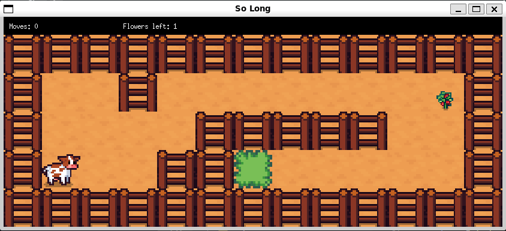

So Long es un juego 2D desarrollado en C como parte del curriculum de 42 Madrid. El jugador debe recolectar todos los objetos del mapa y alcanzar la salida evitando enemigos. Está basado en tiles donde el jugador navega por un mapa, recolecta objetos y evita enemigos para llegar a la salida. El proyecto se enfoca en la gestión de ventanas, manejo de eventos, renderizado gráfico y gestión de memoria.

## Tecnologías

- **Lenguaje:** C
- **Librerías:** MiniLibX, Libft (librería propia), X11
- **Gráficos:** Formato XPM para sprites y texturas
- **Herramientas:** Makefile, algoritmo flood fill, sistema de animación

## Instalación

### Dependencias
```bash
sudo apt-get update
sudo apt-get install gcc make xorg libxext-dev libbsd-dev
```
*Necesitarás descargar la [minilibx de 42 Paris](https://github.com/42paris/minilibx-linux) y añadirla al proyecto.

### Compilación
```bash
git clone https://github.com/aliciavb/so_long.git
cd so_long
chmod +x minilibx-linux/configure
make
```

## Uso

```bash
./so_long maps/example.ber
```

El proyecto incluye varios mapas de prueba en el directorio `maps/`:
- `example.ber` - Mapa básico
- `maze.ber` - Laberinto complejo
- `with_enemies.ber` - Mapa con enemigos
- `big_map.ber` - Mapa grande


## Controles

| Tecla | Acción |
|-------|--------|
| W o ↑ | Mover arriba |
| A o ← | Mover izquierda |
| S o ↓ | Mover abajo |
| D o → | Mover derecha |
| ESC | Salir del juego |

## Estructura del Proyecto

```
so_long/
├── main.c              # Punto de entrada
├── so_long.h          # Header con estructuras
├── Makefile           # Configuración de compilación
├── game/              # Lógica del juego
├── map/               # Procesamiento de mapas
├── Libft/             # Librería propia
├── minilibx-linux/    # Librería gráfica
├── textures/          # Sprites del juego
└── maps/              # Mapas de prueba
```

## ¡Gracias por llegar hasta aquí!

Proyecto completado en Julio 2025
Dime hola por slack en 42 Madrid: @avinals-
O mándame un email: avinals-@student.42madrid.com
